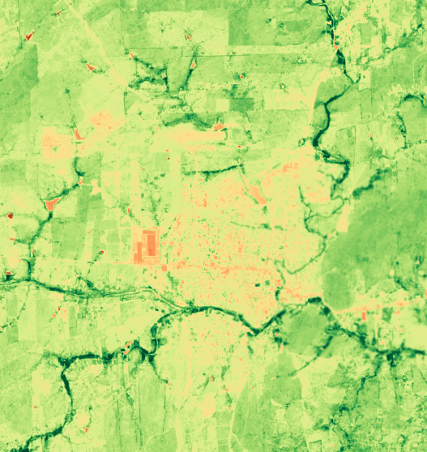

# Sentinel‑2 NDVI **Median** Composite (GEE)

[](https://doi.org/10.5281/zenodo.15589146)

*Clean, reproducible NDVI mosaics in **one click**—with peer‑reviewed cloud masking and per‑pixel median compositing baked‑in.*

---

## What this repo gives you

|  ✔                           |  Benefit                                                                                         |  How it’s guaranteed                                                                              |
| ---------------------------- | ------------------------------------------------------------------------------------------------ | ------------------------------------------------------------------------------------------------- |
| ⚡ **Ready‑to‑run**           | Copy the script into the [GEE Code Editor](https://code.earthengine.google.com) and hit **Run**. | Self‑contained JS file `code/gee_ndvi_annual_median.js`.                                          |
| 🛰 **Cloud‑robust NDVI**     | Removes thick/thin cloud *and* shadows before index calc.                                        | Scene filter < 10 % cloud; pixel mask SCL 4‑7 **&&** `s2cloudless < 40 %` → Wright *et al.* 2024. |
| 📊 **Per‑pixel median**      | Dampens sensor noise & residual haze.                                                            | Median reducer over time stack (common good‑practice).                                            |
| 🎨 **Consistent palette**    | Nine‑step, perceptually‑uniform ramp (brown → red → greens).                                     | Matched to common NDVI legends; colour list hard‑coded in the script.                             |
| 🔁 **Reproducible workflow** | DOI‑frozen release on Zenodo; cite & rerun next season.                                          | Versioned GitHub → Zenodo archiving.                                                              |
| 📚 **Fully referenced**      | Built from primary literature & ESA docs.                                                        | See *References* below; APA‑7, with access dates.                                                 |

> **Ideal for**: vegetation monitoring, baseline layers for ML, classroom demos—anyone who wants a trustworthy NDVI without delving into cloud‑mask minutiae.

<p align="center">
  
  <br>
  <em>Figure 1 – Annual median NDVI (2024) for a sample region of interest (ROI), generated using the default script settings.</em>
</p>

---

## Quick start

|  Step |  Action                                                |
| ----- | ------------------------------------------------------ |
|  1    | Open the GEE Code Editor                               |
|  2    | Copy–paste **`code/gee_ndvi_annual_median.js`**        |
|  3    | Edit ROI `geometry`, `start`, `end` → **Run** & Export |

The script previews the mosaic on the map **and** exports a GeoTIFF (10 m, native CRS of the tile).

---

### Advanced settings (optional)

The script exports **by default in EPSG 4326 (WGS-84 lat/lon)**, which is
universally accepted and perfect for quick-look maps and web overlays.
If you need **metric-accurate area or distance calculations**, open
`code/gee_ndvi_annual_median.js` and either:

1. set **`userCRS = 'EPSG:xxxxx'`** to your known UTM zone, or  
2. leave **`userCRS = null`** and run once — the console will print
   *“Suggested CRS: EPSG:326/327xx”* for your ROI; copy that code back
   into `userCRS` before exporting.

---

## Workflow at a glance

1. **Scene filter**   `CLOUDY_PIXEL_PERCENTAGE < 10` (avoids fogged scenes).
2. **Pixel mask**    keep SCL classes 4–7 **AND** `s2cloudless < 40 %` → removes clouds + shadows.
3. **NDVI per image** `(B8 − B4)/(B8 + B4)` (Rouse *et al.* 1974).
4. **Temporal reducer** *median* per pixel → robust to outliers.

See [`docs/Methodology.md`](docs/Methodology.md) for the scientific rationale (data sources, cloud-mask assumptions, NDVI formula) and advanced customisation notes (monthly mosaics, threshold tuning, alternative ROIs).

---

## Repository layout

```text
├── code/
│   └── gee_ndvi_annual_median.js   # plug-and-play Earth Engine script
├── docs/
│   ├── Methodology.md              # detailed tech note + refs
│   └── media/
│       └── nvdi-model.png          # example image
├── CITATION.cff                    # citation metadata (CFF)
├── LICENSE                         # MIT – applies to code
├── LICENSE-CC-BY.md                # CC BY 4.0 – docs & figures
└── README.md                       # you are here
```

---

## How to cite

> Zimmerle, R. (2025). Sentinel-2 NDVI median composite with cloud masking (v1.0.1). Zenodo. https://doi.org/10.5281/zenodo.15589146
>
> Please cite if this workflow supports your research—citations help justify continued maintenance.

---

## References

* European Space Agency. (2015). *Sentinel‑2 user handbook* (Issue 1, Rev. 2). ESA. Retrieved June 3, 2025, from [https://sentinels.copernicus.eu/documents/247904/685211/Sentinel-2\_User\_Handbook](https://sentinels.copernicus.eu/documents/247904/685211/Sentinel-2_User_Handbook)
* Gorelick, N., Hancher, M., Dixon, M., Ilyushchenko, S., Thau, D., & Moore, R. (2017). Google Earth Engine: Planetary‑scale geospatial analysis for everyone. *Remote Sensing of Environment, 202*, 18‑27. [https://doi.org/10.1016/j.rse.2017.06.031](https://doi.org/10.1016/j.rse.2017.06.031)
* Rouse, J. W., Haas, R. H., Schell, J. A., & Deering, D. W. (1974). Monitoring vegetation systems in the Great Plains with ERTS. In *Proceedings of the 3rd ERTS‑1 Symposium* (pp. 309‑317). NASA. [https://ntrs.nasa.gov/citations/19740022614](https://ntrs.nasa.gov/citations/19740022614)
* Wright, N., Duncan, J. M. A., Callow, J. N., Thompson, S. E., & George, R. J. (2024). CloudS2Mask: A novel deep-learning approach for improved cloud and cloud‑shadow masking in Sentinel‑2 imagery. *Remote Sensing of Environment, 306*, 114122. [https://doi.org/10.1016/j.rse.2024.114122](https://doi.org/10.1016/j.rse.2024.114122)

*Accessed 3 Jun 2025.*

---

## License

- **Source code**: [MIT License](LICENSE)
- **Documentation & media**: [CC BY 4.0](docs/LICENSE-docs.md)